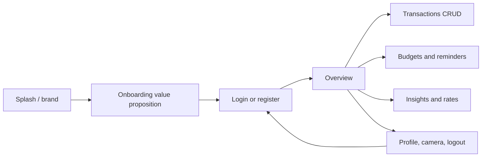
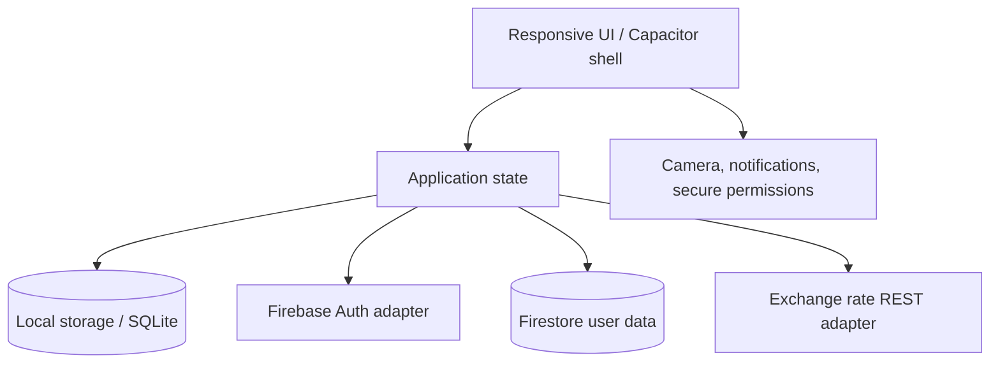
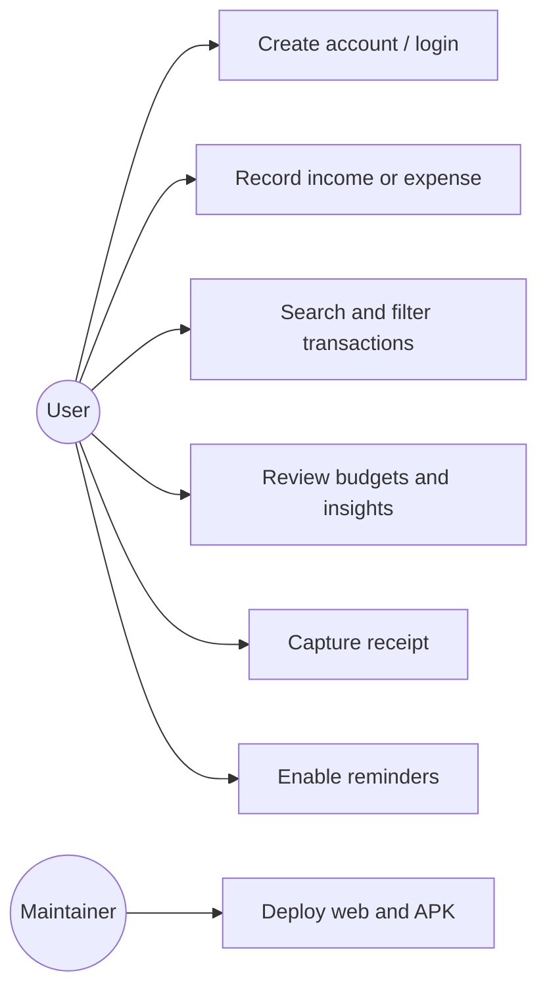
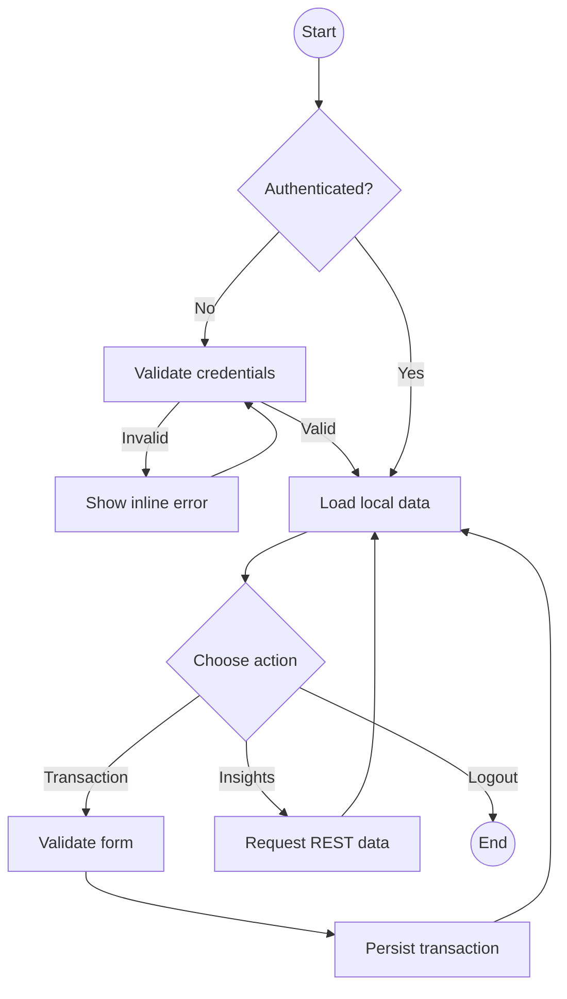
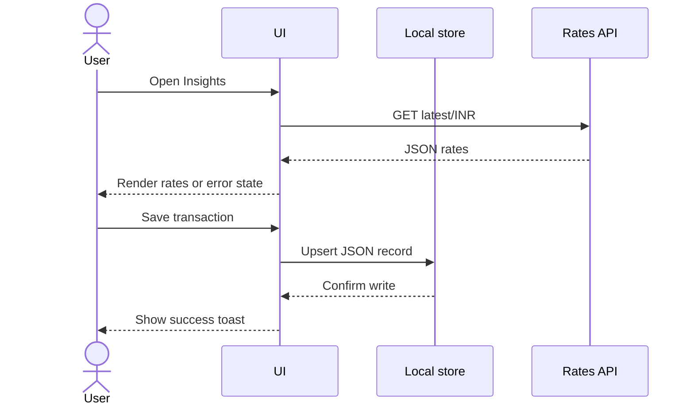
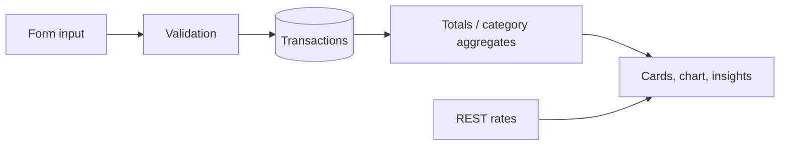
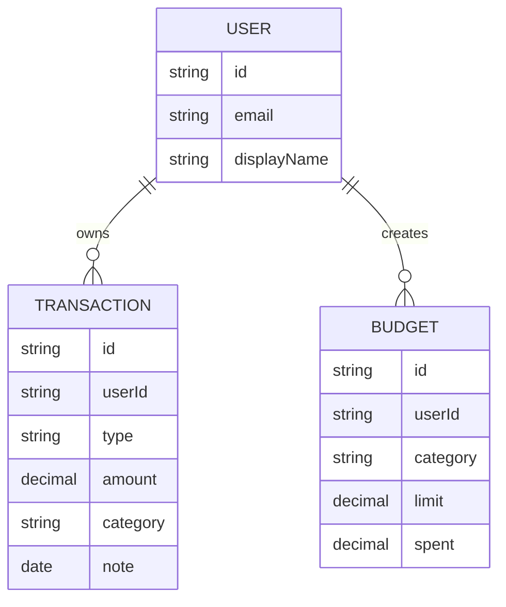
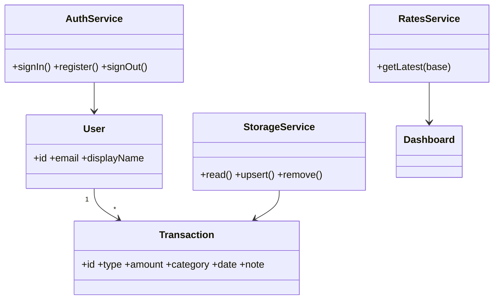

# SpendWise project documentation

## User flow and navigation

## System architecture

## Use cases

## Activity diagram

## Sequence diagram

## Data flow and ER model

## Class/component model

## UI/UX screen descriptions

| Screen | Purpose | Key states |
|---|---|---|
| Auth | Login, registration, demo entry | Invalid input, success |
| Overview | Financial snapshot | Loading, populated, empty |
| Transactions | CRUD and discovery | Search empty, filtered empty |
| Budgets | Category limits and reminders | Permission denied, warning |
| Insights | Advice and exchange data | API loading/error |
| Settings | Profile, camera, logout | Camera permission denied |

## Deployment runbook

1. Push the folder to a GitHub repository.
2. Import the repository into Vercel or Netlify with no build command and `.` as the output directory.
3. Replace the Live Website URL in `README.md`.
4. Capture mobile screenshots into `screenshots/`.
5. Add Firebase config via environment variables and deploy security rules.
6. Wrap with Capacitor, build a signed release APK, and test camera, notification, offline CRUD, and logout on an emulator.
7. Record the 3–5 minute flow and replace the demo URL.

## Presentation checklist

Title, problem, proposed solution, objectives, existing/proposed system, features, stack, architecture, UI screens, database, API, hardware permissions, test evidence, GitHub, APK, website, video, and future enhancements.

## Future enhancements

Recurring transactions, OCR receipt extraction, bank integrations, multi-currency budgets, biometric lock, scheduled notifications, and encrypted cloud backup.
